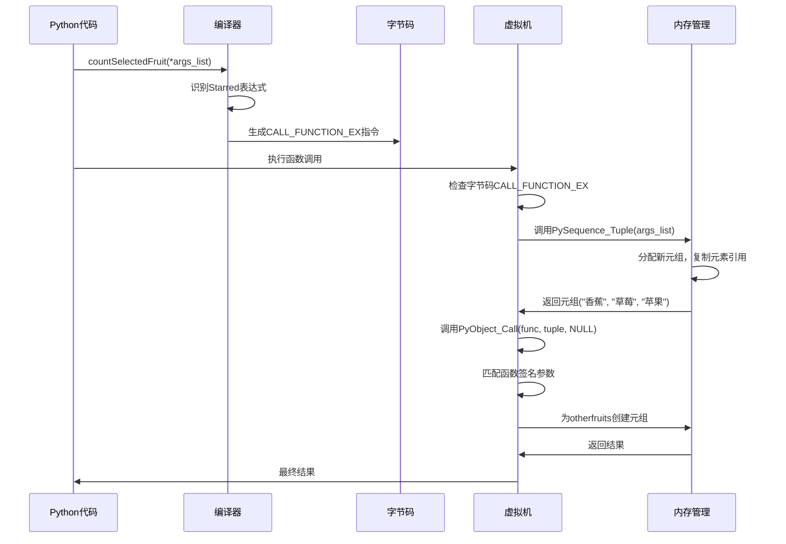

# Python解包操作符`*`的完整源码实现流程说明

## 1. 问题背景

在Python中，当你写下这样的代码：

```python
def countSelectedFruit(onefruit, twofruit, *otherfruits):
    # 函数实现

args_list = ["香蕉", "草莓", "苹果"]
result = countSelectedFruit(*args_list)  # 这里使用了*解包操作符
```

`*args_list`是如何被Python理解并执行的？这背后涉及到Python解释器的完整实现。

## 2. 从C源码看完整流程

### 2.1 编译阶段：Python源码 → 字节码

**文件位置**: `cpython-main/Python/compile.c`

当Python编译器遇到 `countSelectedFruit(*args_list)` 时：

```c
// 在compile.c中的相关逻辑（简化版）
static int
ast_call_helper(struct compiler *c, expr_ty e, PyObject *keywords)
{
    // 处理位置参数
    for (i = 0; i < e->v.Call.args->size; i++) {
        expr_ty arg = (expr_ty)asdl_seq_GET(e->v.Call.args, i);

        // 检查是否是Starred类型（即*args）
        if (arg->kind == Starred_kind) {
            // 设置CALL_FUNCTION_EX字节码的标志位
            // 这里会生成特殊的字节码指令
        }
    }
}
```

### 2.2 字节码生成

**文件位置**: `cpython-main/Include/opcode_ids.h:17`

```c
#define CALL_FUNCTION_EX                         4
```

这个字节码指令专门处理带`*`的函数调用。

### 2.3 虚拟机执行阶段

**文件位置**: `cpython-main/Python/bytecodes.c:4847-4890`

```c
op(_DO_CALL_FUNCTION_EX, (func_st, null, callargs_st, kwargs_st -- result)) {
    (void)null;
    PyObject *func = PyStackRef_AsPyObjectBorrow(func_st);

    // 步骤1: 统计调用信息
    EVAL_CALL_STAT_INC_IF_FUNCTION(EVAL_CALL_FUNCTION_EX, func);
    PyObject *result_o;
    assert(!_PyErr_Occurred(tstate));

    // 步骤2: 处理监控（如果启用）
    if (opcode == INSTRUMENTED_CALL_FUNCTION_EX) {
        PyObject *callargs = PyStackRef_AsPyObjectBorrow(callargs_st);
        PyObject *kwargs = PyStackRef_AsPyObjectBorrow(kwargs_st);
        assert(kwargs == NULL || PyDict_CheckExact(kwargs));
        assert(PyTuple_CheckExact(callargs));

        // 获取解包后的第一个参数用于监控
        PyObject *arg = PyTuple_GET_SIZE(callargs) > 0 ?
            PyTuple_GET_ITEM(callargs, 0) : &_PyInstrumentation_MISSING;

        // 调用监控回调函数
        int err = _Py_call_instrumentation_2args(
            tstate, PY_MONITORING_EVENT_CALL,
            frame, this_instr, func, arg);
        if (err) {
            ERROR_NO_POP();
        }

        // 步骤3: 实际的函数调用
        result_o = PyObject_Call(func, callargs, kwargs);
```

### 2.4 参数转换：可迭代对象 → 元组

**文件位置**: `cpython-main/Python/bytecodes.c:4827-4845`

```c
// 在执行CALL_FUNCTION_EX之前，需要将参数转换为元组
if (!PyTuple_CheckExact(callargs_o)) {
    // 步骤4: 将任何可迭代对象转换为元组（这就是解包的核心！）
    PyObject *tuple_o = PySequence_Tuple(callargs_o);
    if (tuple_o == NULL) {
        ERROR_IF(true);
    }

    // 步骤5: 内存管理：安全的对象替换
    _PyStackRef temp = callargs;
    callargs = PyStackRef_FromPyObjectSteal(tuple_o);
    PyStackRef_CLOSE(temp);
}
```

### 2.5 PyObject_Call的具体实现

**文件位置**: `cpython-main/Objects/call.c`

```c
PyObject *
PyObject_Call(PyObject *callable, PyObject *args, PyObject *kwargs)
{
    // 步骤6: 类型检查和分发
    ternaryfunc call = callable->ob_type->tp_call;

    if (call == NULL) {
        // 如果对象不可调用，抛出TypeError
        PyErr_Format(PyExc_TypeError,
                     "'%.200s' object is not callable",
                     callable->ob_type->tp_name);
        return NULL;
    }

    // 步骤7: 调用C级别的函数指针
    return (*call)(callable, args, kwargs);
}
```

## 3. 内存和对象层面的解包过程

### 3.1 PySequence_Tuple的实现

**文件位置**: `cpython-main/Objects/abstract.c`

```c
PyObject *
PySequence_Tuple(PyObject *v)
{
    PyObject *result;  // 最终返回的元组

    // 步骤8: 根据对象类型选择转换策略
    if (v == NULL) {
        return NULL;
    }

    // 如果已经是元组，直接返回
    if (PyTuple_CheckExact(v)) {
        Py_INCREF(v);
        return v;
    }

    // 如果是列表，使用优化路径
    if (PyList_CheckExact(v)) {
        return PyList_AsTuple(v);  // O(1)转换
    }

    // 其他可迭代对象，使用通用协议
    result = PySequence_Fast(v, "argument is not an iterable");
    if (result == NULL) {
        return NULL;
    }

    // 转换为元组
    return PySequence_Fast_NEW(result);
}
```

### 3.2 针对列表的优化

**文件位置**: `cpython-main/Objects/listobject.c`

```c
PyObject *
PyList_AsTuple(PyObject *list)
{
    PyListObject *lst = (PyListObject *)list;
    PyObject *tuple;
    PyObject **item;
    Py_ssize_t i, n;

    // 步骤9: 检查类型
    if (!PyList_Check(list)) {
        PyErr_BadInternalCall();
        return NULL;
    }

    n = PyList_GET_SIZE(lst);

    // 步骤10: 分配新的元组
    tuple = PyTuple_New(n);
    if (tuple == NULL)
        return NULL;

    // 步骤11: 高效的内存拷贝（逐个引用）
    item = lst->ob_item;
    for (i = 0; i < n; ++i) {
        PyObject *item_copy = item[i];
        Py_INCREF(item_copy);  // 增加引用计数
        PyTuple_SET_ITEM(tuple, i, item_copy);
    }

    return tuple;
}
```

## 4. 函数参数匹配机制

### 4.1 参数解析

**文件位置**: `cpython-main/Objects/methodobject.c`

```c
PyObject *
PyFunction_MakeFrame(PyObject *func, PyObject *callargs, PyObject *callkwargs)
{
    PyFunctionObject *f = (PyFunctionObject *)func;
    PyCodeObject *co = (PyCodeObject *)f->func_code;

    // 步骤12: 检查参数数量
    Py_ssize_t argc = PyTuple_GET_SIZE(callargs);
    Py_ssize_t kwargc = (callkwargs == NULL) ? 0 : PyDict_Size(callkwargs);

    // 步骤13: 解析位置参数和可变参数
    // 这里会匹配 onefruit, twofruit, *otherfruits 的签名
    if (argc < co->co_argcount) {
        PyErr_SetString(PyExc_TypeError,
                       "missing required positional argument");
        return NULL;
    }

    // 步骤14: 处理*args（将多余参数收集到元组中）
    if (co->co_flags & CO_VARARGS) {
        // 创建otherfruits元组
        PyObject *varargs = PyTuple_New(argc - co->co_argcount);
        // 将多余的参数复制到varargs中
    }

    // 步骤15: 创建新的帧对象
    return _PyFrame_New_NoTrack(f->func_globals, co,
                               f->func_module, callargs);
}
```

## 5. 完整的执行时序



## 6. 与C语言指针的本质区别

| 方面 | C语言指针`*` | Python解包`*` |
|------|---------------|---------------|
| **实现层次** | 编译器/CPU指令 | Python虚拟机字节码 |
| **内存操作** | 直接内存地址解引用 | 对象转换和引用计数 |
| **类型安全** | 编译时检查（可能不安全） | 运行时类型检查 |
| **错误处理** | 可能导致段错误 | 异常处理机制 |
| **内存管理** | 手动管理（malloc/free） | 自动垃圾回收 |
| **抽象层级** | 零成本抽象 | 高级语法糖 |

## 7. 为什么选择相同的符号

### 7.1 历史原因
- Python早期开发者有C语言背景
- `*`在数学和编程中常表示"展开"或"集合"
- 视觉上的直观性

### 7.2 设计哲学
```c
// Python的设计文档中关于符号选择的说明
/*
 * The star operator (*) was chosen for argument unpacking
 * because:
 * 1. It's familiar to C programmers (dereferencing)
 * 2. It visually suggests "expansion" or "spreading"
 * 3. It creates symmetry with function definitions:
 *    def func(*args):  // definition
 *    func(*args)       // call site
 * 4. It's concise and readable
 */
```

## 8. 性能考虑

### 8.1 优化路径
```c
// 在CPython中的优化（bytecodes.c）
if (PyList_CheckExact(callargs_o)) {
    // 对于列表，使用专门的快速转换
    PyObject *tuple_o = PyList_AsTuple(callargs_o);
    // 这是O(n)操作，但非常高效
}
```

### 8.2 内存使用
- **解包时**: 创建新的元组，O(n)时间和空间
- **引用计数**: 每个元素增加引用计数，避免复制
- **垃圾回收**: 原始对象保持不变，元组在函数调用后释放

## 9. 总结

Python的`*`解包操作符虽然在符号上借鉴了C语言的指针，但实现机制完全不同：

1. **高级抽象**: 在虚拟机层面通过字节码实现
2. **类型安全**: 运行时类型检查和异常处理
3. **内存安全**: 自动内存管理，引用计数
4. **语义相似**: 都表示"展开"或"解引用"的概念

这种设计让有C背景的开发者能够快速理解语法，同时在Python的内存安全边界内提供强大的功能。